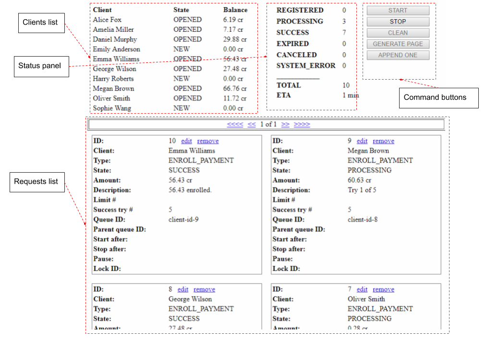
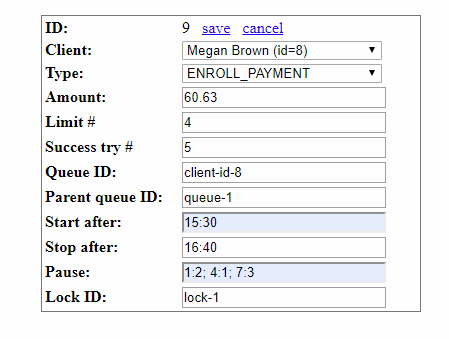

# About

Example of billing adaptor is an JSF application which shows an example how to use the Artezio Guaranteed Delivery library.
It allows to make some testing data, start recovering processing and view result online.

### The application has two pages:

- Main view

Provides main application functionality.

- Request editor

Allows to edit single example request.

### Working with the application divides in next stages:

- Preparing test data
- Executing and monitoring processing in real time
- Reviewing results  

### To prepare test data you have next possibilities:

- Generate 10 random simple request.
- Edit an payment example request.
- Make and define new example request one by one. 

# Main view

### Clients list

### Status panel

### Commands buttons

### Requests list

# Request editor

