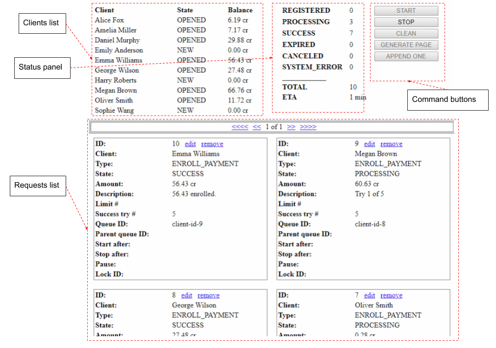

# About

Example of billing adaptor is an web application which shows an example how to use the Artezio Guaranteed Delivery library. It allows to make some testing data, start recovering processing and view result online. When the application starts first time it creates local H2 DB and generate some example data. You can find the DB at target/billing.mv.db file and access it when the application is shutdown.

### The application has two pages:

- Main view

Provides main application functionality.

- Request editor

Allows to edit single example request.

### Working with the application divides in next stages:

- Preparing test data
- Executing and monitoring processing in real time
- Reviewing results  

### To prepare test data you have next possibilities:

- Generate 10 random simple request.
- Edit an payment example request.
- Make and define new example request one by one. 

# Main view

The application main view is designed to view test data and results. It contains controls for data manipulations and executing tests. You can view test processing result at the main view during test execution online. The main view contains next areas:

- Clients list
- Status panel
- Command buttons
- Requests list

### Clients list

The clients lists of the main view is the table that contains 10 automatically generated example clients.
Each client information represented by few columns:

- **Client** : Contains the client full name.
- **State** : Contains the client billing account state.
- **Balance** : Contains current credit amount on the client billing account.

Clients billing account state and balance could be changed dynamically during tests execution by the application. Clients billing state could be:

- **NEW** : The client account is created but no billing operations has been performed on.
- **OPENED** : The client account is opened to accept new billing operations.
- **LOCKED** : The client account is locked for accepting new billing operations.

### Status panel

The status panel of the main view shows numbers example payment requests in the DB dividing them by current state. Also you can view total number of the requests and execution ETA on the status panel. An example payment request could be:

- **REGISTERED** : Payment is registered.
- **PROCESSING** : Payment is currently processing.
- **SUCCESS** : Payment is successfully processed.
- **EXPIRED** : Payment is expired.
- **CANCELED** : Payment process canceled by user.
- **SYSTEM_ERROR** : Example test execution error.

### Command buttons

The command buttons of the main view using for performing all test operations.

- **START** : Start test processing.
- **STOP** : Cancel test processing.
- **CLEAN** : Clean all example payment requests.
- **GENERATE PAGE** : Generate 10 simple example payments requests.
- **APPEND ONE** : Create new simple payment request and and open the request editor with it.

During an test execution all command buttons except **STOP** button are disabled. Otherwise the **STOP** button is disabled. The **CLEAN** button do not clean clients billing accounts.

### Requests list

The requests list of the main view is an data representation of the example payment requests. It contains 10 items per page and a page navigation panel to scroll you data view in case when you have more then 10 requests. Each example payment request have next properties:

- **ID** : Record DB identity.
- **Client** : Billing client.
- **Type** : Billing operation type.
- **State** : Current payment state.
- **Amount** : Payment amount.
- **Description** : Billing processing description.
- **Limit #** : Limit of redelivery tries.
- **Success try #** : Number of example tries to set payment success state. 
- **Queue ID** : Code to specify redelivery queue.
- **Parent queue ID** : Code to specify parent redelivery queue.
- **Start after** : Date and time to start redelivery processing.
- **Stop after** : Date and time to interrupt redelivery processing.
- **Pause** : Recovery processing pause rule.
- **Lock ID** : External code to lock new data storing if it exists.

Each **ID** row contains two command links:

- **edit** : Opens the payment request in the request editor.
- **remove** : Removes the payment request from the DB.

**State**, **Amount**, **Description** data properties could be changed dynamically during tests execution by the application.

# Request editor

The request editor is designed to edit an single example payment request. You could edit next data properties:

 - **Client** : Choose one of existed clients.
 - **Type** : Choose an request type.
 - **Amount** : Enter currency amount from 0.00 up to 100.00
 - **Limit #** : Enter a number from 0 up to 10
 - **Success try #** : Enter a number from 0 up to 10 
 - **Queue ID** : Enter any string ID.
 - **Parent queue ID** : Enter any string ID.
 - **Start after** : Enter a time or date with time. Date format is dd.MM.yyyy Time format is HH:mm
 - **Stop after** : Enter a time or date with time. Date format is dd.MM.yyyy Time format is HH:mm
 - **Pause** : Enter string pause rule. It should follow next regular expression (?:(?:(\d{1,5})\s*:{1}\s*)(?:(\d{1,15})\s*;?\s*))*
 - **Lock ID** : Enter any string ID.

When you chose an a client an standard queue ID is generated. You could correct standard queue ID after an client selected.

Example payment request type could be:

- **ENROLL_PAYMENT** : Enroll a payment to the client account.
- **LOCK_ACCOUNT** : Lock the client account.
- **UNLOCK_ACCOUNT** : Unlock the client account.

Delivery pause rule contains list of timers. Each timer has two parts. First part of the timer defines a number of delivery tries. Second part defines number of seconds to delay next delivery try. It is no matter which order you define timers inside whole pause rule sequence. But, when numbers of delivery tries is sorted upward, is much readable.
An example of a pause rule:

4:10; 9:15; 13:5

- Delivery tries from 1 to 3: you have no delays.
- Delivery tries from 4 to 8: you have 10 seconds delay.
- Delivery tries from 9 to 12: you have 15 seconds delay.
- Delivery tries from 13 and each next try: you have 5 seconds delay.

Number of delay seconds does not guarantee you have next try exactly after that number of seconds. It guarantees that you would not have next delivery try early number of seconds.
